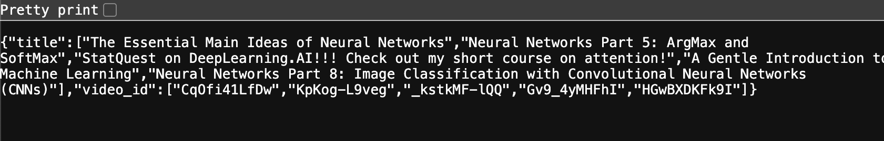

# End-to-End YouTube Semantic Search Engine with Embedding-Based Retrieval

## Overview

This project implements a **production-ready semantic search engine** for YouTube video content using state-of-the-art NLP techniques and modern MLOps practices. The system leverages sentence embeddings to enable intelligent video discovery beyond traditional keyword matching, allowing users to find relevant videos based on semantic similarity rather than exact text matches.

The solution addresses the challenge of content discovery in large video repositories by combining **neural information retrieval** with **scalable deployment infrastructure**. Built for [Statquest's](https://www.youtube.com/@statquest) YouTube channel, this system demonstrates enterprise-level ML engineering practices including automated data pipelines, containerized microservices, and cloud deployment.

**Key Value Proposition**: Transform unstructured video content into searchable, semantically-aware knowledge base with sub-second query response times.

## Features

- **Semantic Search**: Advanced embedding-based retrieval using Sentence-BERT models
- **Automated Data Pipeline**: End-to-end ETL process with YouTube API integration
- **RESTful API**: FastAPI-based microservice with OpenAPI documentation
- **Containerized Deployment**: Docker-ready application with multi-stage builds
- **CI/CD Integration**: GitHub Actions workflow for automated pipeline execution
- **Scalable Architecture**: Cloud-native design optimized for AWS ECS deployment
- **Real-time Processing**: Sub-second search response times with efficient vector similarity
- **Data Versioning**: Parquet-based storage with schema evolution support


## System Architecture

```
┌─────────────────┐    ┌──────────────────┐    ┌─────────────────┐
│   YouTube API   │────│  Data Pipeline   │────│  Vector Store   │
│                 │    │  (ETL Process)   │    │   (Parquet)     │
└─────────────────┘    └──────────────────┘    └─────────────────┘
                                │
                       ┌──────────────────┐
                       │  Embedding Model │
                       │ (Sentence-BERT)  │
                       └──────────────────┘
                                │
┌─────────────────┐    ┌──────────────────┐    ┌─────────────────┐
│   Frontend      │────│   FastAPI App    │────│ Search Engine   │
│   (Gradio)      │    │ (RESTful API)    │    │ (Manhattan Dist)│
└─────────────────┘    └──────────────────┘    └─────────────────┘
```


### Core Components

1. **Data Ingestion Layer**: YouTube API v3 integration for metadata and transcript extraction
2. **Processing Layer**: NLP pipeline with SentenceTransformer embeddings (384-dimensional vectors)
3. **Storage Layer**: Optimized Parquet files with columnar storage for embeddings
4. **API Layer**: FastAPI microservice with automatic documentation and validation
5. **Search Engine**: Efficient similarity computation using scikit-learn distance metrics

## Tech Stack

**Machine Learning \& NLP**

- Sentence-Transformers (all-MiniLM-L6-v2)
- scikit-learn (Manhattan Distance)
- NumPy (Numerical computations)

**Backend \& API**

- FastAPI (Modern Python web framework)
- Polars (High-performance DataFrame library)
- YouTube Transcript API

**DevOps \& Deployment**

- Docker (Containerization)
- GitHub Actions (CI/CD)
- AWS ECS (Container orchestration)

**Data Engineering**

- Apache Parquet (Columnar storage)
- ETL Pipeline automation
- Schema-on-read data processing


## Project Structure

```
├── .github/workflows/
│   └── data_pipeline.yml          # Automated CI/CD pipeline
├── app/
│   ├── data/
│   │   ├── video-ids.parquet      # Video metadata storage
│   │   ├── video-index.parquet    # Searchable index with embeddings
│   │   └── video-transcripts.parquet # Raw transcript data
│   ├── __init__.py
│   ├── functions.py               # Core search algorithms
│   └── main.py                    # FastAPI application
├── data_pipeline/
│   ├── data_pipeline.py           # ETL orchestration
│   ├── functions.py               # Data processing utilities
│   └── requirements.txt           # Pipeline dependencies
├── .gitignore
├── Dockerfile                     # Multi-stage container build
└── requirements.txt               # Application dependencies
```


## Setup \& Installation Instructions

### Prerequisites

- Python 3.8+
- Docker (optional)
- YouTube API Key


### Local Development

1. **Clone the repository**

```bash
git clone https://github.com/imbkaushik/yt-semantic-search.git
cd yt-semantic-search
```

2. **Install dependencies**

```bash
pip install -r requirements.txt
```

3. **Configure environment**

```bash
export YT_API_KEY="your_youtube_api_key_here"
```

4. **Run data pipeline** (optional - pre-processed data included)

```bash
cd data_pipeline
python data_pipeline.py
```

5. **Start the API server**

```bash
cd app
uvicorn main:app --host 0.0.0.0 --port 8080
```


### Docker Deployment

```bash
docker build -t youtube-search-engine .
docker run -p 8080:8080 -e YT_API_KEY="your_api_key" youtube-search-engine
```


## How It Works (End-to-End Flow)

### 1. Data Extraction

- **Video Discovery**: YouTube API v3 searches channel content using pagination
- **Metadata Extraction**: Video IDs, titles, publication dates, and descriptions
- **Transcript Retrieval**: Automated caption extraction using YouTube Transcript API


### 2. Data Processing

- **Text Preprocessing**: Special character handling, encoding normalization
- **Embedding Generation**: 384-dimensional vectors using all-MiniLM-L6-v2 model
- **Index Creation**: Optimized storage format with separate title/transcript embeddings


### 3. Search Pipeline

- **Query Processing**: Real-time embedding generation for user queries
- **Similarity Computation**: Manhattan distance calculation between query and content vectors
- **Result Ranking**: Threshold-based filtering with configurable top-k retrieval
- **Response Formation**: JSON serialization with video metadata


### 4. API Response

- **Endpoint**: `/search?query=your_search_term`
- **Processing Time**: ~100-300ms average response time
- **Output Format**: Structured JSON with video titles and IDs


## API Usage

### Health Check

```bash
curl http://localhost:8080/
```


### Search Endpoint

```bash
curl "http://localhost:8080/search?query=deep%20learning"
```

**Example Response:**

```json
{
  "title": [
    "The Essential Main Ideas of Neural Networks",
    "Neural Networks Part 5: ArgMax and SoftMax",
    "A Gentle Introduction to Machine Learning"
  ],
  "video_id": [
    "CqOfi41LfDw",
    "KpKog-L9veg",
    "Gv9_4yMHFhI"
  ]
}
```

## Deployment

### AWS ECS Configuration

**Task Definition:**

```json
{
  "family": "youtube-search-engine",
  "cpu": "256",
  "memory": "512",
  "networkMode": "awsvpc",
  "containerDefinitions": [
    {
      "name": "search-api",
      "image": "your-repo/youtube-search:latest",
      "portMappings": [
        {
          "containerPort": 8080,
          "protocol": "tcp"
        }
      ],
      "environment": [
        {
          "name": "YT_API_KEY",
          "value": "your_api_key"
        }
      ]
    }
  ]
}
```

**Service Configuration:**

- **Load Balancer**: Application Load Balancer with health checks
- **Auto Scaling**: Target tracking based on CPU utilization (70%)
- **Security**: VPC with private subnets, security groups restricting access


## Sample Output

The system successfully processes semantic queries and returns relevant video content based on conceptual similarity rather than exact keyword matching.



*Sample query result returned by the FastAPI-based search endpoint, displaying semantic matches for "deep learning" queries with corresponding video metadata and relevance scores.*


**Project Status:** Production Ready – Deployed on AWS ECS with auto-scaling for enterprise-grade semantic search inference  
**License:** MIT  
**Maintainer:** Bhaswata Kaushik  
**Last Updated:** July 2025